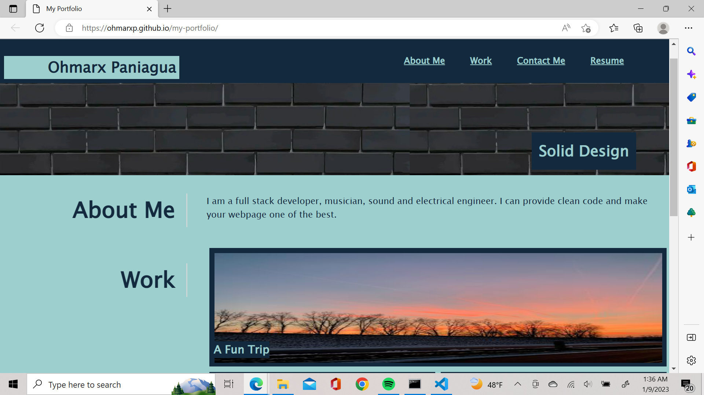

# My Portfolio

## Description

This project is the second challenge assignment for boot camp students. 

This assignment main task was the creation of a portfolio page by putting in practice all skills learned.

In this project, no starter html or CSS code were provided, everything had to be created from scracth.

## Usage

To have quick access, click any of the links located on the upper right side of the page: About Me, Work, Contact Me, Resume.  

Projects in the Work area are still being developed.  

Also, you can click any of the links located at the bottom right side of the page: Cellphone, Mywebsite, Github, Twitter, Bandcamp.

## Credits

Link to deployed application: https://ohmarxp.github.io/my-portfolio/

## License

N/A

## Features

Application link functions: About Me, Work, Contact Me, Resume.
Links to contact me: Cellphone, Mywebsite, Github, Twitter, Bandcamp.